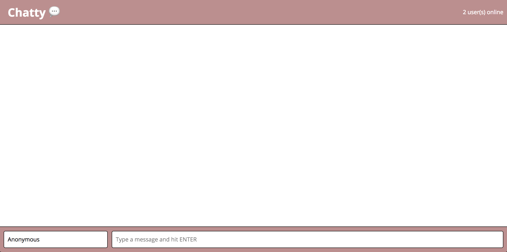
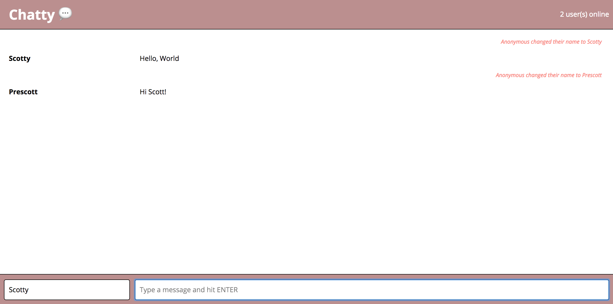

# Chatty App Project

Chatty app is a simple, single-page slack(esque) clone.

This project was a Lighthouse Labs project with the purpose of learning React and Web Sockets. The project was built using Node, Express, A webpack dev server and babel. 

The app allows users to chat with others on the same web socket server. Users can set a username and start sending messages immediately. 

The react boilerplate was taken from: https://github.com/noahlotzer/react-simple-boilerplate.git

### Final Product

### Getting Started

1. Fork this repository, then clone your fork of this repository.
2. Install dependencies using the `npm install` command.
3. Install dependencies for web sockets server in chatty_server directory using the `npm install` command.
4. Start the web sockets server within the chatty_server directory with `node server.js` command.
5. Start the web server using the `npm start` command. The app will be served at <http://localhost:3000/>.
6 Go to <http://localhost:3000/> in your browser (use multiple tabs to communicate between two users). 

### Dependencies

##### Main Server dependencies
* React
* Webpack
* [babel-loader](https://github.com/babel/babel-loader)
* [webpack-dev-server](https://github.com/webpack/webpack-dev-server)

##### Web Socket dependencies
* Web Sockets
* Express